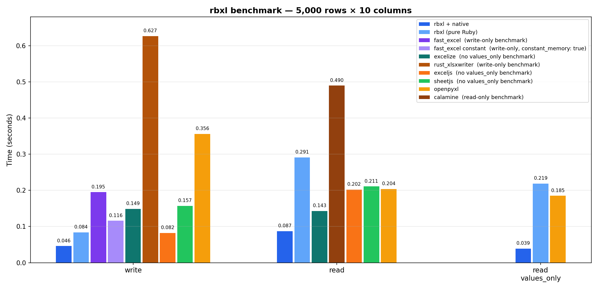

# rbxl

[](https://badge.fury.io/rb/rbxl)

Fast, memory-friendly Ruby gem for row-by-row `.xlsx` reads and append-only writes.

`rbxl` is built for the two workbook workflows that scale cleanly:

- read-only row-by-row iteration
- write-only workbook generation

The API is intentionally small and `openpyxl`-inspired, with an optional
native extension for faster XML parsing when you need more throughput.

Supported:

- write-only workbook generation
- read-only row-by-row iteration
- opt-in date/time conversion driven by the workbook's `numFmt` styles
- optional C extension (`rbxl/native`) for maximum performance

Out of scope:

- in-place editing of an existing `.xlsx` file — rbxl opens workbooks
  read-only and generates new workbooks write-only, with no read-modify-save
  path. If you need to open a file, tweak a handful of cells, and write it
  back preserving everything else, use a full-object-model library instead.
- preserving arbitrary workbook structure on save
- rich style round-tripping
- formulas, images, charts, comments

## Usage

`Rbxl.open` defaults to read-only and `Rbxl.new` defaults to write-only;
the `read_only:` / `write_only:` keywords remain for call-site clarity and
to leave room for a future read/write mode.

### Writing a new workbook

```ruby
require "rbxl"

book = Rbxl.new
sheet = book.add_sheet("Report")
sheet.append(["id", "name", "score"])
sheet.append([1, "alice", 100])
sheet.append([2, "bob", 95.5])
book.save("report.xlsx")
```

Write-only workbooks follow three rules:

- **Append-only within a sheet.** `sheet.append(row)` is the only way to
  add data. There is no random-access cell write, no mid-stream edit of a
  previously appended row.
- **Save-once per workbook.** `save` flushes the full `.xlsx` package in a
  single pass and then closes the workbook. Calling `save` or `add_sheet`
  again raises `Rbxl::WorkbookAlreadySavedError`. To produce another file,
  start a new `Rbxl.new`.
- **No read-modify-save.** rbxl cannot open an existing `.xlsx` and write
  back to it (see Out of scope above).

This is the tradeoff that keeps memory flat: rbxl buffers rows per sheet
and never materializes a full workbook object graph.

### Reading a workbook

```ruby
require "rbxl"

book = Rbxl.open("report.xlsx")
sheet = book.sheet("Report")

sheet.each_row do |row|
  p row.values
end

p sheet.calculate_dimension

book.close
```

### Reading recipes

**Plain value arrays (fastest path).** Use `values_only: true` when you
only care about the cell values, not their coordinates. Rows come back as
frozen `Array<Object>`:

```ruby
book.sheet("Data").each_row(values_only: true) do |values|
  id, name, score = values
  # ...
end
```

**Cell objects with coordinates.** Default `each_row` yields a
`Rbxl::Row` wrapping `Rbxl::ReadOnlyCell`s. Use this when you need the
Excel coordinate alongside the value:

```ruby
book.sheet("Data").each_row do |row|
  row.index              # => 2 (1-based worksheet row number)
  row[0].coordinate      # => "A2"
  row[0].value           # => "alice"
  row.values             # => ["alice", 100, true]
end
```

**Skip the header row.** `each_row` without a block returns an
`Enumerator`, so chain `drop`:

```ruby
book.sheet("Data").each_row(values_only: true).drop(1).each do |row|
  # ...
end
```

**Peek at the first N rows.** `rows(...)` is an enumerator-returning
alias that composes well with `take`, `first`, `lazy`, etc.:

```ruby
book.sheet("Data").rows(values_only: true).first(5)
```

**Know the data range up-front.** When the workbook has a stored
dimension, these are O(1) lookups; otherwise pass `force: true` to scan:

```ruby
sheet = book.sheet("Data")
sheet.max_row              # => 500
sheet.max_column           # => 12
sheet.calculate_dimension  # => "A1:L500"
```

**Pad sparse rows to the sheet width.** Without `pad_cells`, a row
containing only `A1` and `C1` yields two cells. With `pad_cells: true`,
missing cells are filled with `Rbxl::EmptyCell` (or `nil` in values-only
mode), aligned to `max_column`:

```ruby
book.sheet("Sparse").each_row(pad_cells: true, values_only: true).first
# => ["left", nil, "right"]
```

**Expand merged cells.** Excel leaves the anchor cell populated and the
rest of the merge range empty. Pass `expand_merged: true` to propagate
the anchor value across the full range; combine with `pad_cells: true`
when you want the result aligned to the sheet's width:

```ruby
sheet = book.sheet("Merged")

sheet.rows(values_only: true).to_a
# => [["group", "solo"], ["tail"]]

sheet.rows(values_only: true, pad_cells: true, expand_merged: true).to_a
# => [["group", "group", "solo", nil],
#     ["group", "group", "solo", "tail"]]
```

**List sheets before opening any.** Sheet XML is only read on first
iteration; enumerating names is cheap:

```ruby
book.sheet_names        # => ["Summary", "Detail", "Raw"]
book.sheet("Detail").each_row(values_only: true) { |row| ... }
```

**Locate a bad input.** All rbxl exceptions inherit from `Rbxl::Error`
and the messages carry the workbook path and (where relevant) the sheet
name, XML entry, or cell coordinate. Rescue at the sheet level:

```ruby
begin
  book.sheet("Raw").each_row(values_only: true) { |row| ... }
rescue Rbxl::WorksheetFormatError, Rbxl::WorkbookFormatError => e
  warn e.message  # includes workbook path and sheet/entry
rescue Rbxl::CellValueError => e
  warn e.message  # includes workbook path, sheet, and coordinate
end
```

`Rbxl::CellValueError` is raised by the cell decoder when
`date_conversion: true` is active. The reader is forward-only, so rescue
terminates iteration rather than skipping to the next row.

### Date / time conversion

Numeric cells in `.xlsx` files are serial days since 1899-12-31; whether
they display as `44562`, `2022-01-01`, or `12:00` depends on the cell's
`numFmt` style. `rbxl` leaves cells as raw `Float` by default so the read
path stays allocation-light. Pass `date_conversion: true` to opt into
interpreting the style:

```ruby
require "rbxl"

book = Rbxl.open("schedule.xlsx", date_conversion: true)
book.sheet("Timeline").each_row(values_only: true) do |row|
  row.each { |v| p v }  # => Date / Time / Float / String / ...
end
book.close
```

With the flag on, `rbxl` parses `xl/styles.xml` once at first use and
converts numeric cells whose style maps to a built-in date `numFmtId`
(14–22, 27–36, 45–47, 50–58) or to a custom `formatCode` containing date
tokens. Whole-number serials return `Date`; fractional serials return
`Time` so the time-of-day portion is preserved. The flag is off by
default; leaving it off skips the styles parse entirely and keeps the
native fast path in use. Turning it on routes reads through the pure-Ruby
worksheet parser.

## Native C Extension

Add a single `require` to opt-in to the libxml2-based C extension for
significantly faster read and write performance:

```ruby
require "rbxl"
require "rbxl/native"  # opt-in

# Same API, backed by C extension
book = Rbxl.open("large.xlsx", read_only: true)
book.sheet("Data").rows(values_only: true).each { |row| process(row) }
book.close
```

For large worksheets where peak memory matters more than squeezing out the
last few percent of throughput, opt into chunk-fed worksheet inflation:

```ruby
require "rbxl"
require "rbxl/native"

Rbxl.max_worksheet_bytes = 64 * 1024 * 1024

book = Rbxl.open("large.xlsx", read_only: true, streaming: true)
book.sheet("Data").rows(values_only: true).each { |row| process(row) }
book.close
```

The C extension is **opt-in by design**:

- **Portability first**: `require "rbxl"` alone works everywhere Ruby and
  Nokogiri run, with zero native compilation required. This is the default.
- **Performance when you need it**: `require "rbxl/native"` activates the
  libxml2 SAX2 backend for read/write hot paths. If the `.so` was not built
  (e.g. libxml2 headers missing at install time), you get a clear `LoadError`
  rather than a silent degradation.
- **Same API, same output**: switching between the two paths changes nothing
  about behavior or output format. The test suite runs both paths and
  compares results cell-by-cell to guarantee parity.
- **Fallback is automatic at build time**: `gem install rbxl` attempts to
  compile the C extension. If libxml2 is not found, compilation is silently
  skipped and the gem installs successfully without it. You only notice when
  you try `require "rbxl/native"`.
- **Default path buffers the worksheet**: the worksheet ZIP entry is
  inflated into a Ruby string before crossing into C. The extension removes
  XML parse overhead, but not ZIP I/O or that intermediate buffer.
- **Opt-in streaming**: passing `streaming: true` to `Rbxl.open` feeds the
  worksheet XML to the native parser in 64 KiB chunks pulled from the ZIP
  input stream, so peak memory stays roughly independent of sheet size.
  Pair with `Rbxl.max_worksheet_bytes` to cap uncompressed worksheet
  inflation and stop high-compression zip-bomb style entries mid-inflate.
  Throughput is usually within a few percent of the default path. Without
  `require "rbxl/native"`, the flag is accepted but the pure-Ruby reader
  still takes the buffered path.

Requirements for the C extension:

- libxml2 development headers (`libxml2-dev` / `libxml2-devel`), or
- Nokogiri with bundled libxml2 (headers are detected automatically)

## Design Notes

- Writer avoids a full workbook object graph; rows are buffered per sheet and the XML is emitted in a single pass at `save`.
- Reader uses a pull parser for worksheet XML so it can iterate rows without building the full DOM.
- Strings written by the MVP use `inlineStr` to avoid shared string bookkeeping during generation.
- Reader supports both shared strings and inline strings.
- The native extension uses libxml2 SAX2 directly, bypassing Nokogiri's per-node Ruby object allocation overhead.

## Development

Development in this repository assumes Ruby 3.4.8 (`.ruby-version`).

```bash
bundle install
cd benchmark && npm install && cd ..

# Run tests (pure Ruby)
bundle exec ruby -Ilib -Itest test/rbxl_test.rb

# Run tests (with native extension)
cd ext/rbxl_native && ruby extconf.rb && make && cd ../..
bundle exec ruby -Ilib -Itest -r rbxl/native test/rbxl_test.rb
bundle exec ruby -Ilib -Itest test/fast_ext_test.rb

# Benchmarks
bundle exec ruby -Ilib benchmark/compare.rb                     # pure Ruby
bundle exec ruby -Ilib -r rbxl/native benchmark/compare.rb      # with native
RBXL_BENCH_WARMUP=1 RBXL_BENCH_ITERATIONS=5 bundle exec ruby -Ilib benchmark/read_modes.rb

# Generate API docs
bundle exec rake rdoc
```

## Benchmarks

The performance story is primarily about `rbxl/native`.

`require "rbxl"` remains the portability-first default: no native extension is
required, the API stays the same, and the fallback path is still useful for
environments where native builds are inconvenient. But the numbers below are
best read as:

- `rbxl` = portable baseline
- `rbxl/native` = performance mode

5000 rows x 10 columns, Ruby 3.4 / Python 3.13 / Node 24:



### Portable Baseline (`require "rbxl"`)

| benchmark | real (s) |
|---|---|
| rbxl write | 0.08 |
| rbxl read | 0.29 |
| rbxl read values | 0.22 |
| fast_excel write | 0.18 |
| fast_excel write constant | 0.12 |
| exceljs write | 0.08 |
| exceljs read | 0.19 |
| sheetjs write | 0.13 |
| sheetjs read | 0.20 |
| openpyxl write | 0.36 |
| openpyxl read | 0.21 |
| openpyxl read values | 0.18 |
| excelize write | 0.15 |
| excelize read | 0.14 |

### Performance Mode (`require "rbxl/native"`)

| benchmark | real (s) | vs exceljs/openpyxl |
|---|---|---|
| rbxl write | **0.05** | about 1.8x faster than exceljs, 2.5x faster than fast_excel constant, 7.7x faster than openpyxl |
| rbxl read | **0.09** | about 2.3x faster than exceljs, 2.4x faster than openpyxl |
| rbxl read values | **0.04** | about 4.8x faster than openpyxl values |

The comparison script uses these libraries when available:

Benchmark notes:

- `RBXL_BENCH_WARMUP` and `RBXL_BENCH_ITERATIONS` control warmup and repeated runs.
- Read comparisons use the same `rbxl.xlsx` fixture for `rbxl`, `roo`, `rubyXL`, and `openpyxl`.
- `fast_excel` adds write-only comparisons for both its default mode and `constant_memory: true`.
- JS comparisons use the same `rbxl.xlsx` fixture for `exceljs` and `sheetjs`.
- Write comparisons still measure each library producing its own workbook.
- `rss_delta_kb` is best-effort process RSS on Linux and should be treated as directional.
- Install JS benchmark dependencies with `cd benchmark && npm install`.

- `rbxl` for write/read
- `fast_excel` for write / constant-memory write
- `exceljs` for write/read
- `sheetjs` for write/read
- `excelize` (Go) for write/read
- `rust_xlsxwriter` (Rust) for write
- `calamine` (Rust) for read
- `rubyXL` for full workbook read
- `openpyxl` as a Python reference point when `openpyxl` or `uv` is available
