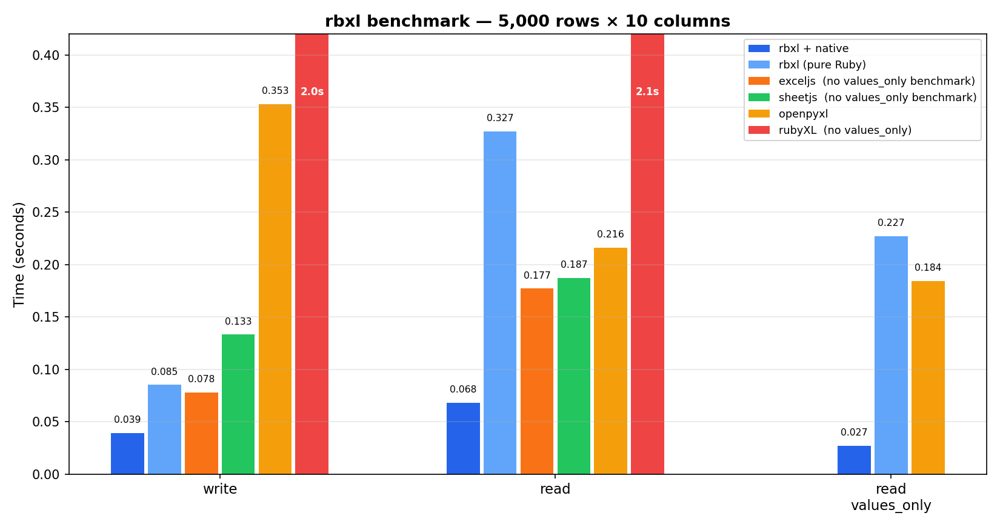

# rbxl

`openpyxl` inspired Ruby gem for large-ish `.xlsx` files.

Current scope is intentionally small:

- `write_only` workbook generation
- `read_only` row streaming
- `close()` for read-only workbooks
- minimal `openpyxl`-like API
- optional C extension (`rbxl/native`) for maximum performance

Out of scope for this MVP:

- preserving arbitrary workbook structure on save
- rich style round-tripping
- formulas, images, charts, comments

## Usage

```ruby
require "rbxl"

book = Rbxl.new(write_only: true)
sheet = book.add_sheet("Report")
sheet.append(["id", "name", "score"])
sheet.append([1, "alice", 100])
sheet.append([2, "bob", 95.5])
book.save("report.xlsx")
```

```ruby
require "rbxl"

book = Rbxl.open("report.xlsx", read_only: true)
sheet = book.sheet("Report")

sheet.each_row do |row|
  p row.values
end

p sheet.calculate_dimension

book.close
```

`write_only` workbooks are save-once by design. This matches the optimized
mode tradeoff: low flexibility in exchange for simpler memory behavior.

## Native C Extension

Add a single `require` to opt-in to the libxml2-based C extension for
significantly faster read and write performance:

```ruby
require "rbxl"
require "rbxl/native"  # opt-in

# Same API, backed by C extension
book = Rbxl.open("large.xlsx", read_only: true)
book.sheet("Data").rows(values_only: true).each { |row| process(row) }
book.close
```

The C extension is **opt-in by design**:

- **Portability first**: `require "rbxl"` alone works everywhere Ruby and
  Nokogiri run, with zero native compilation required. This is the default.
- **Performance when you need it**: `require "rbxl/native"` activates the
  libxml2 SAX2 backend for read/write hot paths. If the `.so` was not built
  (e.g. libxml2 headers missing at install time), you get a clear `LoadError`
  rather than a silent degradation.
- **Same API, same output**: switching between the two paths changes nothing
  about behavior or output format. The test suite runs both paths and
  compares results cell-by-cell to guarantee parity.
- **Fallback is automatic at build time**: `gem install rbxl` attempts to
  compile the C extension. If libxml2 is not found, compilation is silently
  skipped and the gem installs successfully without it. You only notice when
  you try `require "rbxl/native"`.
- **Current boundary cost is explicit**: worksheet ZIP entries are still
  inflated into a Ruby string before crossing into C. The extension removes
  XML parse overhead, but not ZIP I/O or that intermediate buffer.

Requirements for the C extension:

- libxml2 development headers (`libxml2-dev` / `libxml2-devel`), or
- Nokogiri with bundled libxml2 (headers are detected automatically)

## Design Notes

- Writer avoids a full workbook object graph and streams rows into sheet XML.
- Reader uses a pull parser for worksheet XML so it can iterate rows without building the full DOM.
- Strings written by the MVP use `inlineStr` to avoid shared string bookkeeping during generation.
- Reader supports both shared strings and inline strings.
- The native extension uses libxml2 SAX2 directly, bypassing Nokogiri's per-node Ruby object allocation overhead.

## Development

```bash
bundle install

# Run tests (pure Ruby)
ruby -Ilib -Itest test/rbxl_test.rb

# Run tests (with native extension)
cd ext/rbxl_native && ruby extconf.rb && make && cd ../..
ruby -Ilib -Itest -r rbxl/native test/rbxl_test.rb
ruby -Ilib -Itest test/fast_ext_test.rb

# Benchmarks
ruby -Ilib benchmark/compare.rb                     # pure Ruby
ruby -Ilib -r rbxl/native benchmark/compare.rb      # with native
RBXL_BENCH_WARMUP=1 RBXL_BENCH_ITERATIONS=5 ruby -Ilib benchmark/read_modes.rb
```

## Benchmarks

5000 rows x 10 columns, Ruby 3.4 / Python 3.13:



### Pure Ruby (Nokogiri Reader)

| benchmark | real (s) |
|---|---|
| rbxl write | 0.09 |
| rbxl read | 0.30 |
| rbxl read values | 0.22 |
| openpyxl write | 0.36 |
| openpyxl read | 0.28 |
| openpyxl read values | 0.26 |

### With `rbxl/native`

| benchmark | real (s) | vs openpyxl |
|---|---|---|
| rbxl write | **0.04** | 9x faster |
| rbxl read | **0.08** | 3.5x faster |
| rbxl read values | **0.03** | 9x faster |

The comparison script uses these libraries when available:

Benchmark notes:

- `RBXL_BENCH_WARMUP` and `RBXL_BENCH_ITERATIONS` control warmup and repeated runs.
- Read comparisons use the same `rbxl.xlsx` fixture for `rbxl`, `roo`, `rubyXL`, and `openpyxl`.
- Write comparisons still measure each library producing its own workbook.
- `rss_delta_kb` is best-effort process RSS on Linux and should be treated as directional.

- `rbxl` for write/read
- `caxlsx` for write
- `roo` for read streaming
- `rubyXL` for full workbook read
- `openpyxl` as a Python reference point when `openpyxl` or `uv` is available
